1. [Assemble the RGB Matrix HAT](#assemble-the-rgb-matrix-hat)
2. [Attach the HAT and battery](#attach-the-hat-and-battery)
3. [Attach the RGB Matrix panels](#attach-the-rgb-matrix-panels)
4. [Prepare the software](#prepare-the-software)
5. [Try it out](#try-it-out)

---

# Assemble the RGB Matrix HAT 

### Materials:

* [Adafruit RGB Matrix + Real Time Clock HAT](https://learn.adafruit.com/adafruit-rgb-matrix-plus-real-time-clock-hat-for-raspberry-pi)
* 40-pin GPIO header
* 16-pin HUB75 header
* 2-pin screw terminal
* Soldering iron
* Rosin core solder (also called flux core solder)

> _The RGB Matrix HAT is a purpose-built circuit board for powering and controlling LED matrix panels. HAT stands for Hardware Attached on Top, but before we can attach the HAT atop your Raspberry Pi it must be soldered together. If this is your first time using a soldering iron, check out the [Adafruit guide to excellent soldering](https://learn.adafruit.com/adafruit-guide-excellent-soldering) before continuing. Practice a few solder joints to make sure you're up to speed. If you don't have spare electronics stuff at hand you can try paperclips, coins, keyrings, or other metal objects (avoid aluminum because its oxide layer makes it hard to solder)._

- Solder the 40-pin GPIO header to the underside of the board, and the 16-pin HUB75 header to the top. Make sure the notch on the HUB75 header aligns with the notch drawn on the board. Use a PCB holder, tape, or picture hanging putty to hold the parts in place if needed. 

- Solder the screw terminal to the top of the board, making sure the terminals (where you will attach power wires) face outward. Use plenty of solder to attach this part, as it will carry all the power to the LED panels.

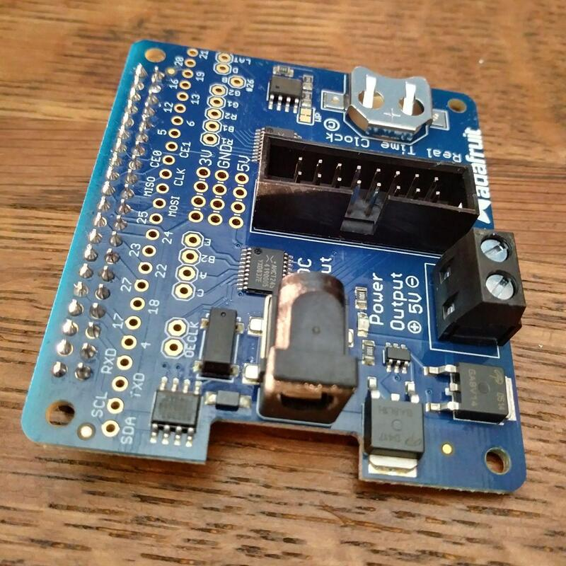

---

# Attach the HAT and battery

### Materials:

* [Raspberry Pi 3 Model B+](https://www.adafruit.com/product/3775)
* Fully-assembled RGB Matrix HAT
* CR1220 3V battery
* [Brass M2.5 Standoffs for Pi HATs](https://www.adafruit.com/product/2336) (optional)

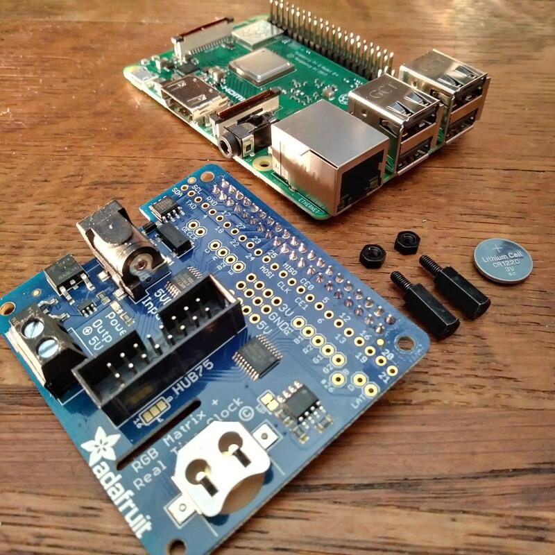

> _The Raspberry Pi does not, by itself, have a way to remember the date and time while switched off, but the HAT provides this capability with a small quartz crystal clock powered by a battery. When attached to the GPIO pins of the Pi, the HAT will also supply the Pi with power._

- Screw the optional standoffs to the HAT for stability and plug its 40-pin header to the 40 GPIO (general-purpose input/output) pins on the Raspberry Pi. Insert the coin cell battery with its + side facing up.

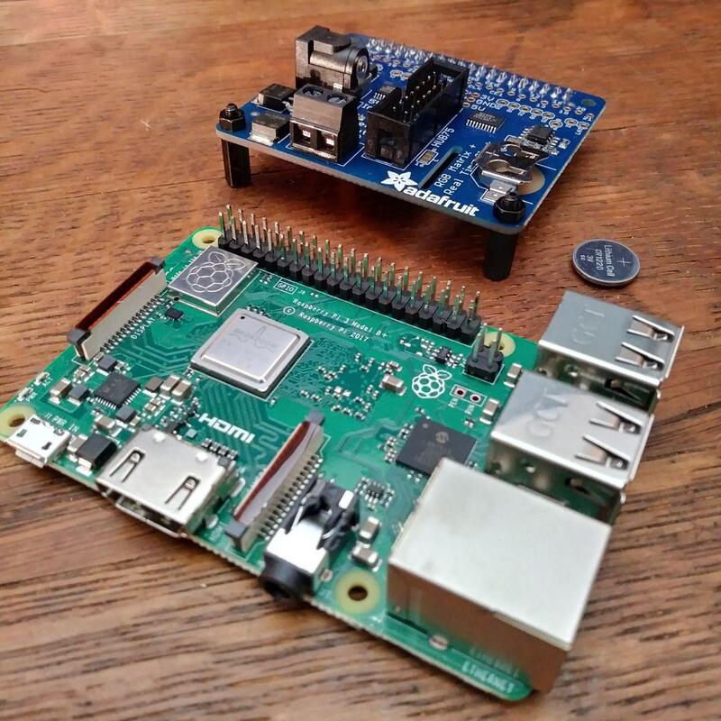

---

# Attach the RGB Matrix panels

### Materials:

* Raspberry Pi with RGB Matrix HAT
* 1–3 [64x32 RGB LED Matrix](https://www.adafruit.com/product/2279) panels (3–6mm pitch)
* 1–3 16-pin ribbon cables (1 per matrix panel)
* 1–2 RGB matrix power harnesses

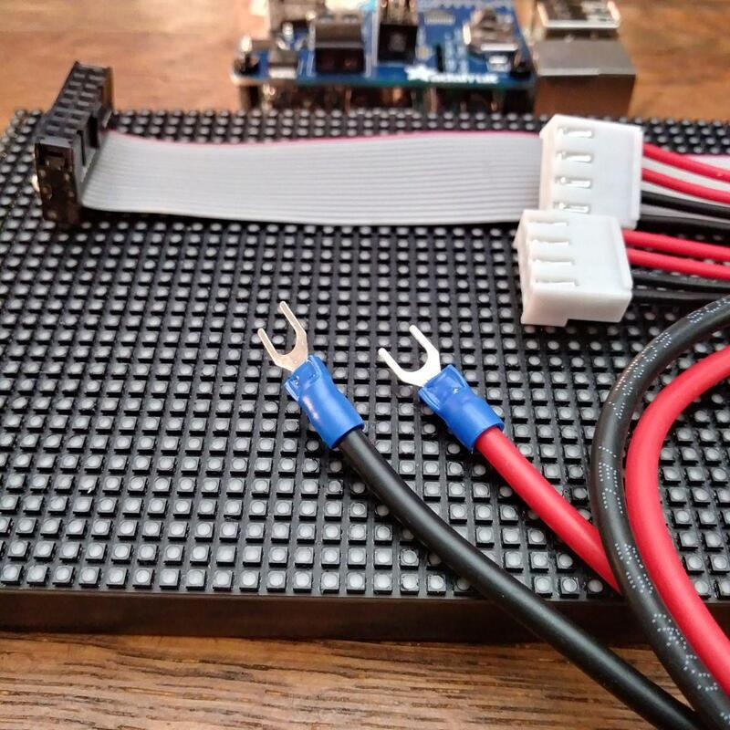

> _HUB75 RGB matrix panels, which can be purchased from a number of manufacturers, use a standard interface which allows them to be chained together. These panels vary in their manner of using the 16 pins to carry information, so if you use a type other than those sold by Adafruit, your clock's software may require [tuning.](https://github.com/hzeller/rpi-rgb-led-matrix/blob/master/README.md)_

- Attach the fork terminals of the red (+) and black (-) wires on the power harness to the screw terminal of the HAT, and the 16-pin ribbon cable to the HUB75 header. Attach one of the connectors on the power harness to a matrix panel. Attach the ribbon cable to the matrix panel. Be sure to connect it to the side of the panel which has an arrow pointing toward the panel's center.

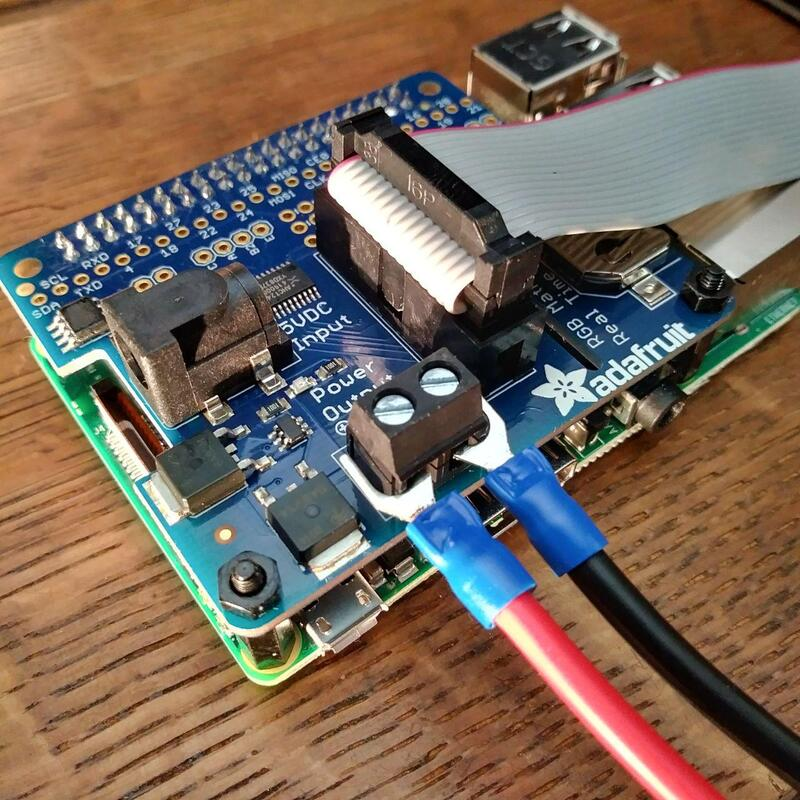

- If using more 2 or 3 matrix panels, connect the power harness's other connector to a second panel, and bridge the two panels with a ribbon cable, again guided by the directionality of the arrows.

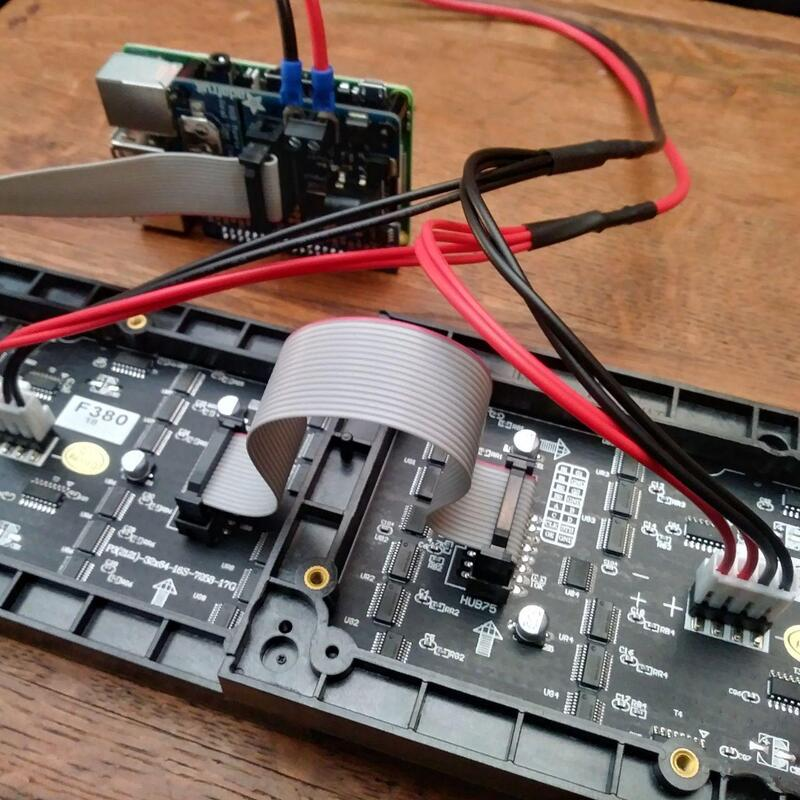

- If using 3 matrix panels, connect an additional power harness to the screw terminal of the HAT. Be certain that the fork terminals cannot come loose and cause a short circuit by touching opposite-colored wires. You may wish to splice the same-colored wires of both harnesses together so that a single pair of fork terminals can be used. Chain the third panel's ribbon cable in the same manner as the second.

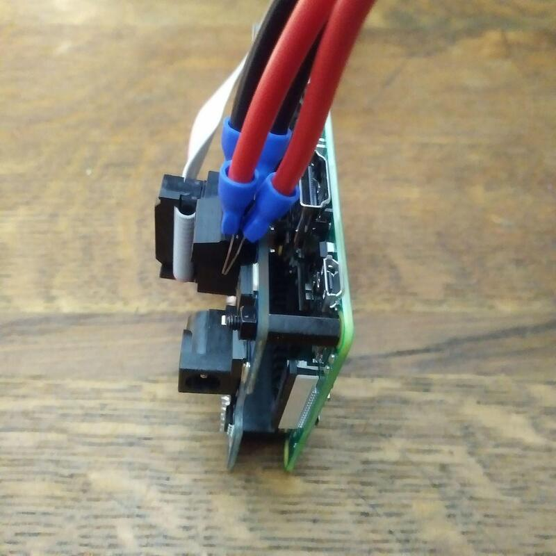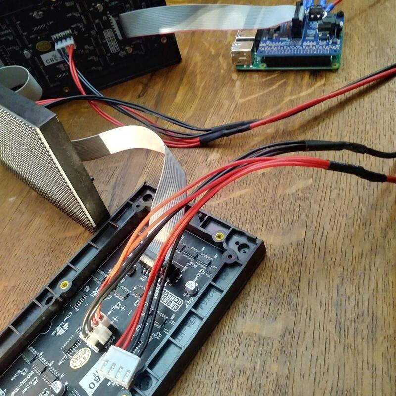

---

# Prepare the software

### Materials:
* MicroSD memory card, 4GB or larger
* Computer running Mac OS, Windows, or Linux, with a MicroSD card reader or slot
* [balenaEtcher](https://www.balena.io/etcher/) for writing memory card images
* [CLIMATECLOCK memory card image](https://github.com/???)

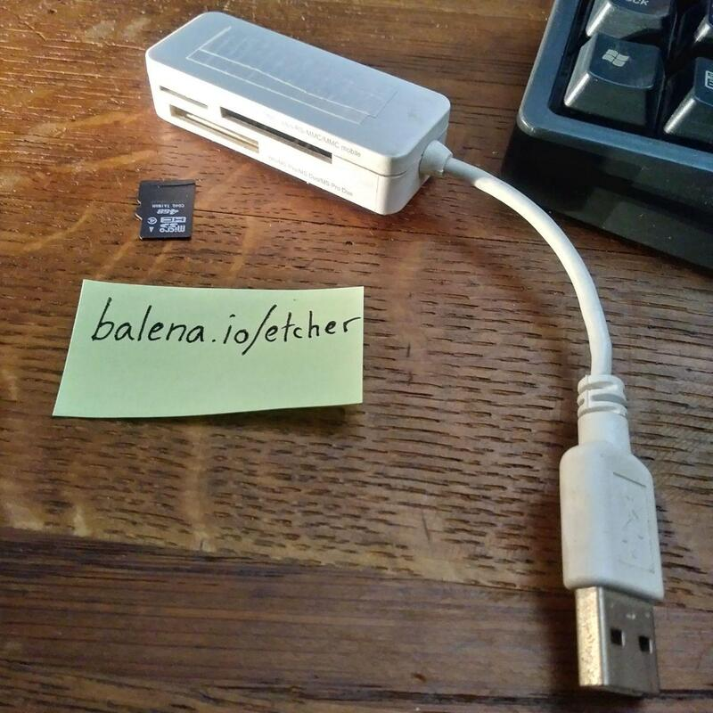

> _This software includes a Linux operating system based on [Raspbian](https://www.raspberrypi.org/downloads/raspbian/), the official operating system from the Raspberry Pi Foundation. We've modified Raspbian in a couple simple ways to work with the HAT. If you're interested in further customization, have a look at [our code for building the system on github](https://github.com/BeautifulTrouble/climate-clock-kit/tree/master/pi)._

> _The software also includes a [Python](https://www.python.org/about/) program for controlling your CLIMATECLOCK. [This program](https://github.com/BeautifulTrouble/climate-clock-kit/blob/master/clock/climateclock.py) follows a simple methodology for calculating the 1.5°C global carbon budget, and clockmakers who have basic experience with the Python programming language should find it easy to customize._

---

- Download a [CLIMATECLOCK memory card image](???) to your computer. Choose the appropriate file for 1, 2, or 3 64x32 matrix panels. The files are nearly identical, but they've been pre-configured to use different numbers of panels. All three can be adjusted to work like the others by changing one number in a [config file](https://github.com/BeautifulTrouble/climate-clock-kit/blob/master/clock/config.py) on the memory card.

- Install [balenaEtcher](https://www.balena.io/etcher/), a tool for writing images to memory cards. If you prefer to use other tools (like `dd`), go right ahead and skip the following step. Be aware that just copying the image file *onto* the memory card, like by dragging the image file to the card's icon, **will not work!** It's important to copy the image with an appropriate tool.

- Copy the image:

    * Connect the MicroSD card reader with the card inside, or use your computer's MicroSD card slot.
    * Open balenaEtcher and select from your hard drive the CLIMATECLOCK `.img` file you downloaded
    * Select the card you'll write the image to
    * Click Flash!

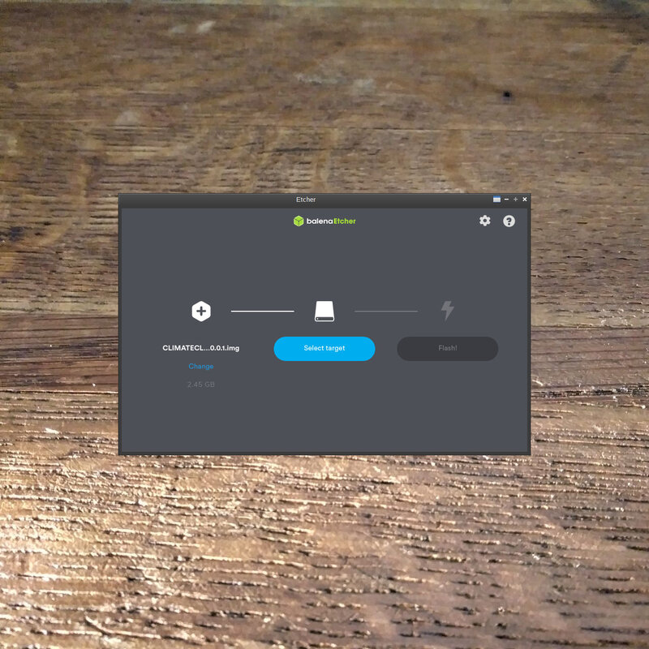

- Safely remove or eject the MicroSD card and insert it into the slot on the underside of the Raspberry Pi.

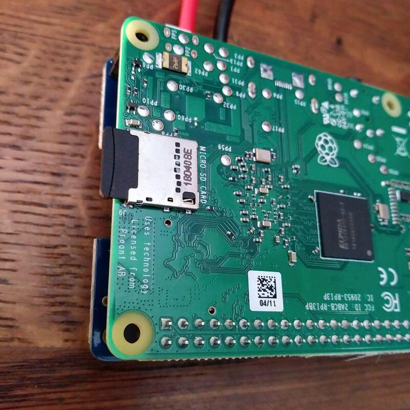

---

# Try it out

### Materials:
* Your brand new CLIMATECLOCK
* [5V 4000mA Switching Power Supply](https://www.adafruit.com/product/1466)
* Ethernet cable connected to the internet (a WiFi router or the box from your ISP should work, we just need something with DHCP)

> _The CLIMATECLOCK needs to connect to the internet at least one time to set its clock. And if climate change predictions change, we'll update our numbers on github, and connecting to the internet will update the clock (TODO: not yet implemented)._

- Plug the internet-connected ethernet cable into your CLIMATECLOCK, then plug in the power supply. The device should take 15-20 seconds to boot.

